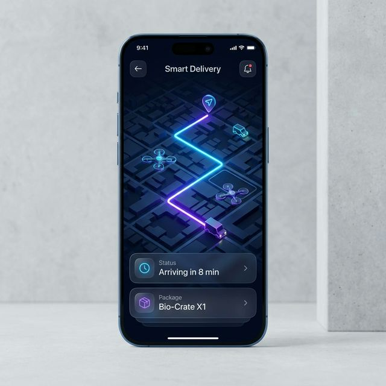

# 🚚 Smart Delivery App

<p align="center">
  
</p>

<p align="center">
  
  
  
  
  
</p>

---

## ✨ Overview

**Smart Delivery** is a high-performance, full-stack logistics solution designed for the modern era. Combining a robust **Node.js** backend with a cutting-edge **Kotlin** Android application, it provides a seamless real-time tracking experience for both customers and drivers.

Whether you're managing thousands of deliveries or tracking a single package, Smart Delivery offers the precision, speed, and elegance required in today's on-demand economy.

---

## 🚀 Key Features

| Feature | Description |
| :--- | :--- |
| **🛰️ Real-Time Tracking** | Live driver location updates powered by Socket.io and background services. |
| **🗺️ Intelligent Mapping** | High-performance map integration using **OSMDroid** (OpenStreetMap) – no Google Maps API keys required! |
| **🔐 Enterprise Security** | Stateless **JWT Authentication** and high-entropy password hashing with **Bcrypt**. |
| **📦 Order Lifecycle** | Full CRUD capabilities for order management with real-time status transitions. |
| **🎨 Premium UX/UI** | A stunning Dark Mode aesthetic with **Lottie** micro-animations and Material Design 3 components. |
| **⚡ Scalable Architecture** | Redis-ready backend and Hilt-powered dependency injection on Android. |

---

## 🏗️ Deep Dive Architecture

### 🛡️ Backend (The Engine)
Built with scalability in mind, the backend follows a strict **MVC/Service** pattern:
- **Runtime:** Node.js v20+ with Express 5.0.
- **Data Layer:** MongoDB via Mongoose with optimized indexing for location queries.
- **Real-time Hub:** Socket.io managing bi-directional communication channels for instant delivery pings.
- **State Management:** Redis integration (configurable) for high-speed session and location caching.

### 📱 Android (The Interface)
A masterpiece of modern Android development (MAD):
- **Language:** 100% Kotlin.
- **Architecture:** MVVM (Model-ViewModel-View) for clean separation of logic.
- **Networking:** Retrofit + OkHttp with custom Interceptors for seamless API interaction.
- **Location:** Integrated Foreground Tracking Service ensuring location updates even when the app is minimized.
- **Dependency Injection:** Dagger Hilt for modular and testable code.

---

## 🛠️ Technology Stack & Versions

Smart Delivery leverages the latest stable versions of industry-standard technologies to ensure reliability and performance.

### 🛡️ Backend Engine
- **Runtime:** Node.js `v20.11.0` (LTS)
- **Framework:** Express.js `^5.2.1`
- **Database:** MongoDB `v7.0` / Mongoose `^9.1.2`
- **Real-time:** Socket.io `^4.8.3`
- **Security:** JWT `^9.0.2` & Bcrypt JS `^3.0.3`

### 📱 Android Application
- **Language:** Kotlin `1.9.22`
- **Build System:** Gradle `8.2` (KTS)
- **SDK Support:** Min SDK `26`, Target SDK `34` (Android 14)
- **Architecture:** Jetpack MVVM
- **Dependency Injection:** Hilt `2.50`
- **Networking:** Retrofit `2.9.0` & OkHttp `4.12.0`
- **Maps:** OSMDroid `6.1.18`

---

## 💻 Step-by-Step Setup Guide

Follow these instructions to set up the entire ecosystem on a fresh PC.

### 1️⃣ Prerequisites
Ensure you have the following installed on your system:
- **Node.js (v20+):** [Download here](https://nodejs.org/)
- **Java Development Kit (JDK 17):** [Download here](https://adoptium.net/temurin/releases/?version=17)
- **Android Studio (Iguana or newer):** [Download here](https://developer.android.com/studio)
- **MongoDB:** (Local instance or [Atlas Cloud](https://www.mongodb.com/cloud/atlas))

---

### 2️⃣ Backend Configuration
Open your terminal/command prompt and run:

1. **Clone the project & Navigate:**
   ```bash
   cd SmartDeliveryApp-master/backend
   ```
2. **Install Dependencies:**
   ```bash
   npm install
   ```
3. **Set Environment Variables:**
   Create a file named `.env` in the `backend` folder and paste:
   ```env
   PORT=3000
   MONGO_URI=mongodb://localhost:27017/smart-delivery # Or your Atlas URL
   JWT_SECRET=your_security_key_here
   ```
4. **Start the Server:**
   ```bash
   npm start
   # You should see: "Server running on port 3000"
   ```

---

### 3️⃣ Android Mobile Setup
1. **Launch Android Studio:** Choose "Open" and select the `android` folder of this project.
2. **Configure SDKs:**
   - Go to `Settings > Languages & Frameworks > Android SDK`.
   - Ensure `Android 14.0 (UpsideDownCake)` (API 34) is installed.
3. **Gradle Sync:**
   - Click the "Elephant" icon (Sync Project with Gradle Files). Wait for completion.
4. **Update API Endpoint:**
   - Open `android/app/src/main/java/com/example/smartdeliveryapp/data/api/RetrofitClient.kt`.
   - Change the `BASE_URL` to your computer's IP address (e.g., `http://192.168.1.15:3000/api/`).
   - *Note: Do not use `localhost` if testing on a physical device.*
5. **Run the App:**
   - Connect a device or launch an emulator.
   - Click the Green Play button in Android Studio.

---

### 4️⃣ Verification Checklist
- [ ] Backend console shows "Connected to Database".
- [ ] Android App launches and shows the Login screen.
- [ ] Users can register and login successfully.
- [ ] Real-time map shows current location marker.

---

## 📄 License & Contribution

This project is licensed under the **ISC License**. Designed for developers who value performance and clean architecture.

---

<p align="center">
  <b>Built for the future of logistics.</b><br>
  Developed with ❤️ by the Smart Delivery Team
</p>
